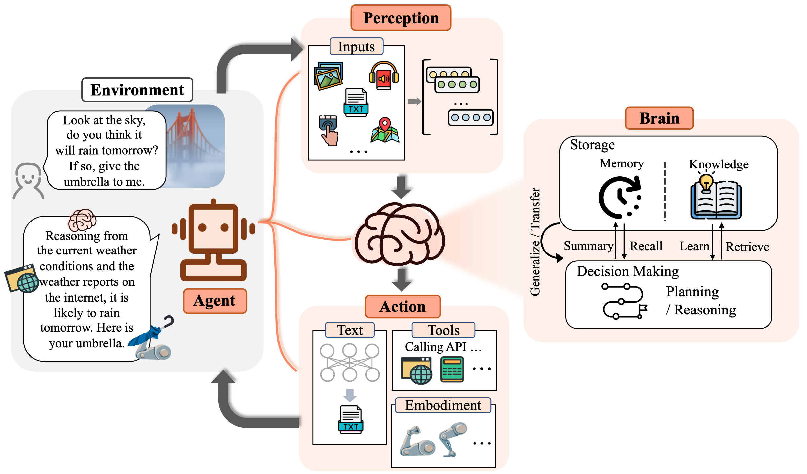

# Awsome Large Language Model-based Agent Surveys

## Introduction

> An autonomous agent is a system situated within and a
> part of an environment that senses that environment and
> acts on it, over time, in pursuit of its own agenda and so
> as to effect what it senses in the future.”
> -- Franklin and Graesser (1997)

Importantly, the concept of an agent involves individual autonomy, granting them the ability
to exercise volition, make choices, and take actions, rather than passively reacting to external stimuli. 

The early stages of AI research focused on symbolic AI, which used logical rules and symbols to represent 
knowledge and facilitate reasoning. However, this approach had limitations in handling uncertainty 
and complex real-world problems.
To overcome these limitations, researchers turned to reinforcement learning, 
which enables agents to learn through interactions with their environments. 
Reinforcement learning faces challenges such as long training times, low sample efficiency, 
and stability concerns.
Meta-learning is another approach that focuses on learning how to learn. It allows an agent to quickly 
infer optimal policies for new tasks from a small number of samples, reducing the need for large volumes 
of data. However, this approach can struggle with significant disparities between source and target tasks.
Large Language Model-based agents offer a different approach, providing comprehensive internal world knowledge 
that enables informed actions even without domain-specific training. These agents can also provide natural 
language interfaces to interact with humans, making them more flexible and explainable compared to other methods.

This repo aims to collect some excellent surveys in this field and the must-read papers they recommended.
We greatly appreciate the researchers that want to promote their fantastic to contribute via PRs, issues, emails, or
other methods.

## A survey on large language model based autonomous agents

*Wang, Lei, et al.* **"A survey on large language model based autonomous agents."** Frontiers of Computer Science 18.6 (
2024): 1-26.
[[Survey](https://arxiv.org/abs/2308.11432)][[Recommended papers](https://github.com/Paitesanshi/LLM-Agent-Survey)]

This is the first released and published survey paper in the field of LLM-based agents.

The survey begins by discussing the construction of LLM-based autonomous agents, 
proposing a unified framework that encompasses much of previous work. 
This framework consists of four modules: profiling, memory, planning and action.

- The profiling module aims to indicate the profiles of the agent roles, which
  are typically written into the prompt to influence the LLM's behavior. 
  Agent profiles typically encompass basic information such as age, gender, and
  career, as well as psychology information, reflecting the personalities of the agent, 
  and social information, detailing the relationships between agents.
- The memory module plays a crucial role in storing information perceived from the 
  environment and leveraging the recorded memories to facilitate future actions.
  The module enables the agent to accumulate experiences, self-evolve, and behave 
  in a more consistent, reasonable, and effective manner.
- When faced with a complex task, humans tend to break them down into simpler subtasks 
  and solve them individually. The planning module aims to empower agents with this human 
  capability. The memory and planning modules place the agent into a dynamic environment,
  enabling it to recall past behaviors and plan future actions.
- The action module is responsible for translating the agent’s decisions into specific outcomes. 
  This module is located at the most downstream position and directly interacts with the environment.

Throughout these modules, the profiling module impacts the memory and planning modules, and collectively,
these three modules influence the action module.

In addition to providing a comprehensive overview of LLM-based autonomous agents, 
the survey also offers a summary of commonly used strategies for acquiring agent capabilities, 
both with and without model fine-tuning.
It also provides a systematic overview of the diverse applications of LLM-based autonomous agents across 
social science, natural science, and engineering. This allows readers to gain a deeper understanding 
of the potential impact of these agents in various fields.
Finally, the survey delves into the strategies for evaluating LLM-based autonomous agents, 
focusing on both subjective and objective evaluation methods. This provides valuable insights for 
researchers and developers seeking to assess the performance and effectiveness of these agents in 
real-world scenarios.

## The Rise and Potential of Large Language Model Based Agents: A Survey

*Xi, Zhiheng, et al. "The rise and potential of large language model based agents: A survey." arXiv preprint arXiv:
2309.07864 (2023).
[[Survey](https://arxiv.org/abs/2309.07864)][[Recommended papers](https://github.com/WooooDyy/LLM-Agent-Paper-List)]

This is the most comprehensive survey in the field of LLM-based agents. They present a general conceptual framework 
with three key parts:
- Brain: The core of the agent, which is primarily composed of a large language model and similar to the human brain, 
  responsible for storing memories, processing information, making decisions, and planning.
- Perception: Similar to that of sensory organs for humans. Expands the agent's sensory capabilities from text-only 
  to multimodal, including various senses (text, sound, visuals, touch, smell, etc.).
- Action: Enables the agent to take various actions, such as producing textual output, taking embodied actions, 
  using tools, and altering its environment.

Agents operate in the following workflow: First, the perception module, corresponding to human sensory
systems, perceives changes in the external environment and then converts multimodal information into an 
understandable representation for the agent. Subsequently, the brain module, serving as the control center, 
engages in information processing activities such as thinking, decision-making, and operations with storage 
including memory and knowledge. Finally, the action module, corresponding to human limbs, carries out the
execution with the assistance of tools and leaves an impact on the surroundings. By repeating the
above process, an agent can continuously get feedback and interact with the environment.

The survey also covers the practical applications of LLM-based agents, including:
- Single Agent Applications: The current uses of single agents, highlighting their capabilities in handling specific 
  tasks, driving innovation, and exhibiting human-like survival skills and adaptability.
- Multi-Agent Systems: A retrospective look at the development history of multi-agents, introducing interactions 
  between agents in LLM-based systems, where they collaborate, negotiate, or compete.
- Human-Agent Collaboration: Discussions on the collaboration between humans and agents, considering the potential
  limitations of LLM-based agents in aspects such as privacy security, ethical constraints, and data deficiencies.

Finally, the survey concludes with an introduction to the concept of "Agent Society", examining the intricate 
interactions between agents and their surrounding environments. It begins with an investigation into whether 
these agents exhibit human-like behavior and possess corresponding personality. Furthermore, it
introduces the social environments within which the agents operate, including text-based environment,
virtual sandbox, and the physical world.

## Other Paper List

- [https://github.com/AGI-Edgerunners/LLM-Agents-Papers](https://github.com/AGI-Edgerunners/LLM-Agents-Papers)
- [https://github.com/zjunlp/LLMAgentPapers](https://github.com/zjunlp/LLMAgentPapers)
- [https://github.com/git-disl/awesome-LLM-game-agent-papers](https://github.com/git-disl/awesome-LLM-game-agent-papers)
- [https://github.com/lafmdp/Awesome-Papers-Autonomous-Agent](https://github.com/lafmdp/Awesome-Papers-Autonomous-Agent)
- [https://github.com/taichengguo/LLM_MultiAgents_Survey_Papers](https://github.com/taichengguo/LLM_MultiAgents_Survey_Papers)
- [https://github.com/Jenqyang/Awesome-AI-Agents](https://github.com/Jenqyang/Awesome-AI-Agents)

